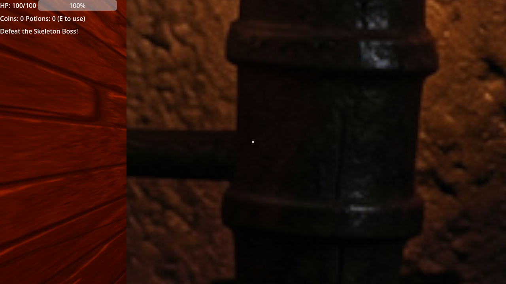

# Eldoria: Shadow Realms

A 3D fantasy dungeon crawler built in **Godot 4.4.1** with **FAL.ai-generated textures**.

## Game
Explore procedurally generated dungeons, fight skeletons and goblins, collect the Golden Key, defeat the Skeleton Boss, and escape through the magical Portal!

## Controls
| Key | Action |
|-----|--------|
| **WASD** | Move |
| **Mouse** | Look around |
| **Left Click** | Sword attack |
| **Right Click** | Block (reduces damage by 70%) |
| **E** | Use health potion |

## Features
- **Procedural dungeon generation** — 8 rooms connected by corridors, random enemy placement
- **First-person 3D** with mouse-look camera
- **Combat system** — melee attacks, blocking, ranged enemy projectiles
- **Enemy types**: Skeleton Warriors (melee), Goblin Archers (ranged), Skeleton Boss (final)
- **Items**: Health potions, coins, Golden Key
- **Objective**: Defeat the boss → collect key → escape through portal
- **HUD**: HP bar, coin counter, potion counter, key status, boss objective
- **Win/Lose screens** with restart

## FAL Asset Manifest
All textures/sprites generated with **fal-ai/fast-sdxl**:
| Asset | Prompt |
|-------|--------|
| `wall_texture.png` | Seamless dungeon wall texture, dark stone bricks with moss |
| `floor_texture.png` | Seamless dungeon floor texture, old cobblestone floor |
| `ceiling_texture.png` | Seamless dungeon ceiling texture, wooden beams and stone |
| `hero_knight.png` | Fantasy hero knight character, 3D render style, isolated |
| `skeleton_warrior.png` | Fantasy skeleton warrior enemy, undead with sword, isolated |
| `goblin_archer.png` | Fantasy goblin archer enemy, green-skinned with bow, isolated |
| `skeleton_boss.png` | Giant skeleton boss enemy, massive undead with greatsword |
| `golden_key.png` | Golden key item, ornate fantasy dungeon key, magical glow |
| `health_potion.png` | Health potion bottle, red glowing healing potion |
| `portal_gate.png` | Magical portal gate, glowing blue portal with arcane runes |
| `treasure_chest.png` | Treasure chest, wooden fantasy chest with golden trim |
| `wall_torch.png` | Dungeon torch on wall, medieval wall-mounted torch with flame |

## Tech Stack
- Godot 4.4.1 (Forward+ renderer)
- GDScript with class_name global classes
- FAL.ai for all visual assets
- Billboard sprites for enemies (always face camera)
- CSG meshes with FAL textures for environment
- OmniLight3D torches for atmospheric dungeon lighting

## Build
```bash
cd /home/ganomix/projects/eldoria-3d
/home/ganomix/tools/godot/Godot_v4.4.1-stable_linux.x86_64 --path .
```

## Screenshot

